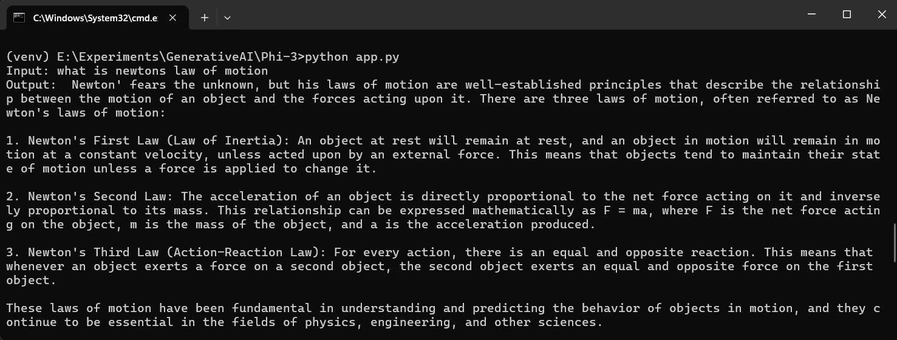
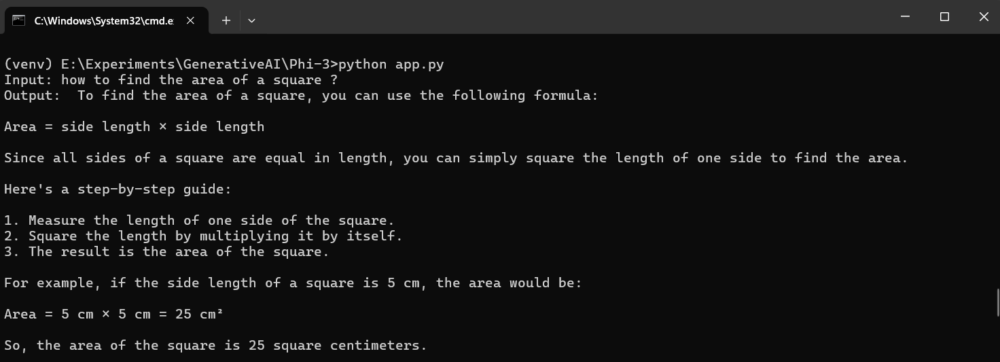
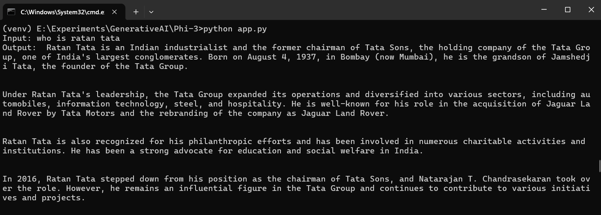

# Sample code for Phi-3 in Python





## Setup

1. Download the model

   ```shell
   huggingface-cli download microsoft/Phi-3-mini-4k-instruct-onnx --include cpu_and_mobile/cpu-int4-rtn-block-32-acc-level-4/* --local-dir .
   ```

2. Install the API
   
   ```shell
   pip install numpy
   pip install --pre onnxruntime-genai
   ```

3. Run the model

   ```python
   import onnxruntime_genai as og

   model = og.Model('cpu_and_mobile/cpu-int4-rtn-block-32-acc-level-4')
   tokenizer = og.Tokenizer(model)
   tokenizer_stream = tokenizer.create_stream()
    
   # Set the max length to something sensible by default,
   # since otherwise it will be set to the entire context length
   search_options = {}
   search_options['max_length'] = 2048

   chat_template = '<|user|>\n{input} <|end|>\n<|assistant|>'

   text = input("Input: ")
   if not text:
      print("Error, input cannot be empty")
      exit

   prompt = f'{chat_template.format(input=text)}'

   input_tokens = tokenizer.encode(prompt)

   params = og.GeneratorParams(model)
   params.set_search_options(**search_options)
   params.input_ids = input_tokens
   generator = og.Generator(model, params)
  
   print("Output: ", end='', flush=True)

   try:
      while not generator.is_done():
        generator.compute_logits()
        generator.generate_next_token()

        new_token = generator.get_next_tokens()[0]
        print(tokenizer_stream.decode(new_token), end='', flush=True)
   except KeyboardInterrupt:
       print("  --control+c pressed, aborting generation--")

   print()
   del generator
   ```